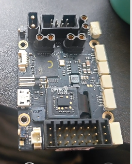
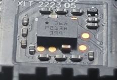
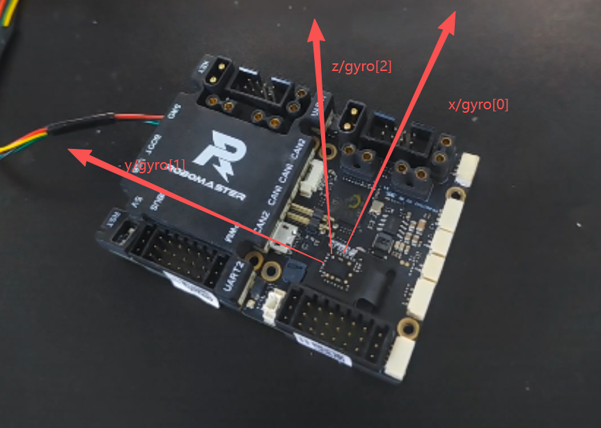

# BMI088 芯片方向与 C 板坐标系

> 实物验证来源：C 板背面（元器件面）剥开硅胶减震外壳后，可直接观察 BMI088 芯片本体。

## 实物图

### 芯片位置（C 板背面全景）

> BMI088 位于 C 板中心偏下，底部大排针正上方。

### 芯片特写（剥开硅胶外壳）

> 芯片丝印：565 / P2138 / 399。Pin1 黑点标记在芯片左上角（靠近短边方向）。

---

## 芯片坐标系推导

### 数据手册定义

BMI088 数据手册标准方向定义,详见[[01_extracted/hardware/bmi088-datasheet#芯片坐标系（数据手册定义）]]，本文不重复。

### 实际在c板中安装方向

^ebf8bb

> 红色标注：x/gyro[0]（前）、y/gyro[1]（左）、z/gyro[2]（上）