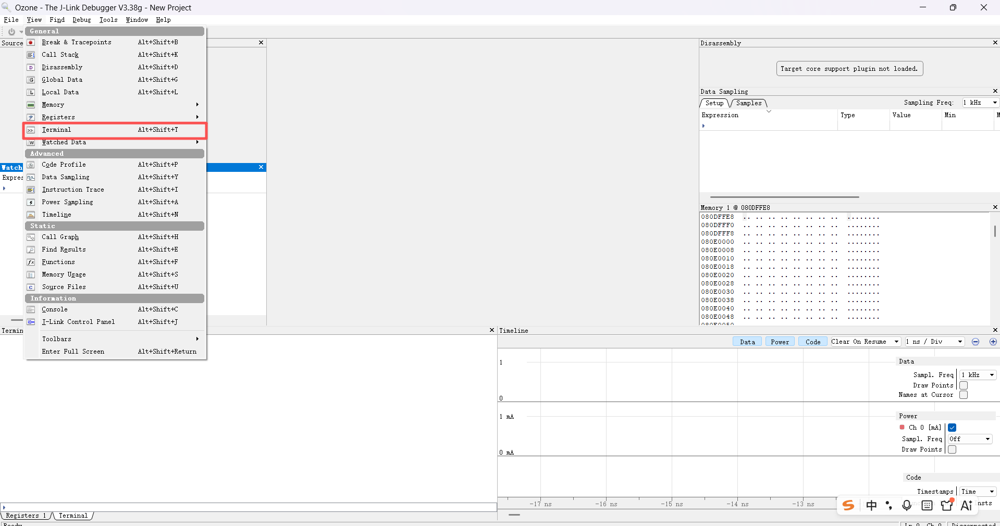
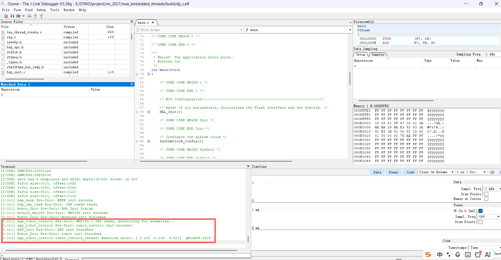

# ULOG 日志系统使用说明

> 对应源码：`utils/ulog/` — 基于 SEGGER RTT 的轻量级日志系统。

---

## 概述

项目使用自研的 ulog 日志系统，通过 **SEGGER RTT** 输出日志，在 Ozone 的 Terminal 面板中实时查看。支持多级别过滤、颜色输出、线程名标注和时间戳。

---

## 快速使用

### 1. 在源文件中引入

```c
#define LOG_TAG "my_module"      // 日志标签，用于区分不同模块
#define LOG_LVL LOG_LVL_INFO      // 本文件的编译输出级别
#include "ulog_def.h"
```

### 2. 输出日志

```c
LOG_E("something went wrong, err=%d", status);   // 错误（红色）
LOG_W("unexpected value: %.4f", val);             // 警告（黄色）
LOG_I("init ok, ver=%s", version);                // 信息（绿色）
LOG_D("accel=[%d %d %d]", x, y, z);              // 调试（无色）
LOG_HEX("packet", 16, buf, len);                  // 十六进制 dump
LOG_ASSERT(ptr != NULL);                          // 断言失败后死循环
```

### 3. 在 Ozone 中查看日志

下载并烧录程序后，在 Ozone 中按以下路径打开 Terminal：

**View → Terminal**（快捷键 `Alt+Shift+T`）



打开后即可实时看到 `LOG_I` / `LOG_W` / `LOG_E` 输出的日志。



上图是 test-app 分支运行 BMI088 异常检测程序时的实际日志输出。可以看到每条日志包含时间戳、模块标签、线程名和消息内容，例如：

```
[0.011] app_robot_control Pre-Init: BMI088 + INS ready, monitoring for anomalies...
[0.013] app_robot_control robot_control_thread: Baseline accel: [ 0.128 -0.154  9.821]  gNorm=9.8228
```

> **注意**：日志系统通过 SEGGER RTT 输出，要求 J-Link 已连接且 Ozone 处于运行状态。

---

## 日志级别

| 宏 | 值 | 颜色 | 用途 |
|----|-----|------|------|
| `LOG_LVL_ASSERT` | 0 | 洋红 | 断言失败 |
| `LOG_LVL_ERROR` | 3 | 红色 | 错误，需关注 |
| `LOG_LVL_WARNING` | 4 | 黄色 | 异常但不影响运行 |
| `LOG_LVL_INFO` | 6 | 绿色 | 常规信息 |
| `LOG_LVL_DBG` | 7 | 无色 | 调试细节 |

### 编译过滤

```c
#define LOG_LVL LOG_LVL_INFO   // 本文件只编译 INFO 及以上级别
```

全局输出上限由 `ULOG_OUTPUT_LVL` 控制（默认 `LOG_LVL_DBG`）。

---

## 日志格式

每条日志包含以下信息（可通过 `ulog_def.h` 中的宏开关控制）：

```
[时间戳] 标签 线程名: 消息内容
```

例如：

```
[1.234] app_robot_control robot_control_thread: Baseline accel: [0.12 -9.81 0.34]  gNorm=9.81
```

> 时间戳单位为秒.毫秒，来自 `HAL_GetTick()`。

---

## main 阶段日志盲区

日志系统在 `ulog_init()` 调用后才可用，而 `ulog_init()` 通常在 RTOS 调度器启动后的 BSP 初始化阶段才调用。因此在 `main()` 和 `tx_application_define()` 阶段的 `LOG_I` **不会输出**。

**替代方案**：此时可通过 Ozone 直接读取寄存器值，或使用 `printf` 直连串口输出。

详见踩坑记录 [[../../04_notes/踩坑记录#2026-07-18---bmi088-标定-flash-写入失败pgserr]]。

---

## 相关文件

| 文件 | 说明 |
|------|------|
| `utils/ulog/ulog.h` | 对外 API 声明 |
| `utils/ulog/ulog.c` | 实现（基于 SEGGER RTT + eyalroz/printf） |
| `utils/ulog/ulog_def.h` | 配置宏与 LOG_I/W/E 宏定义 |
