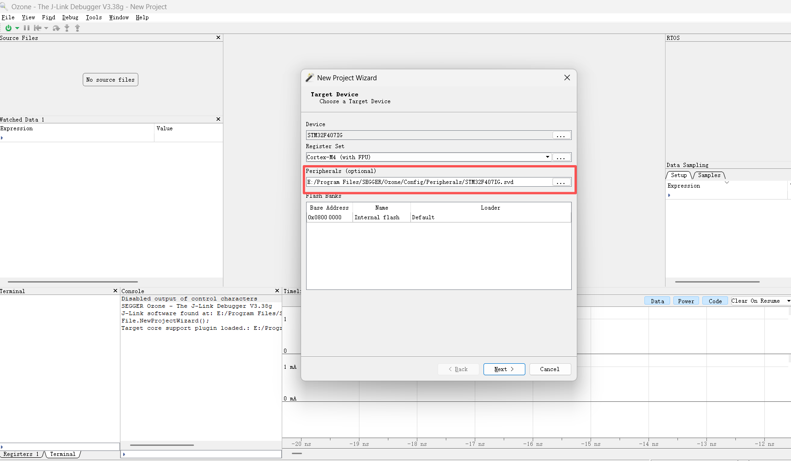
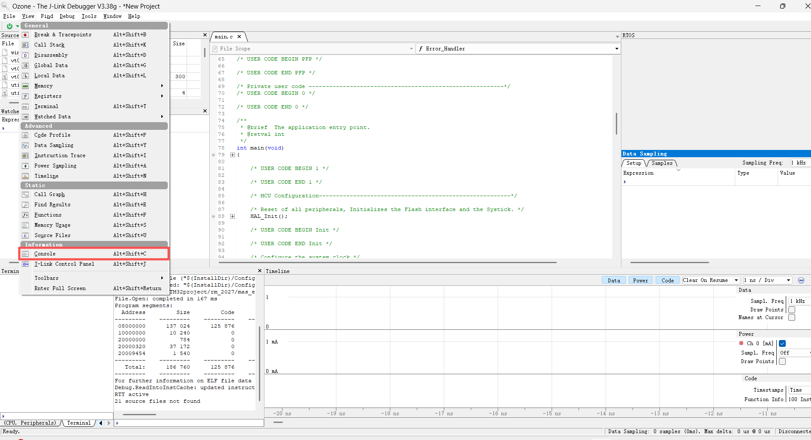
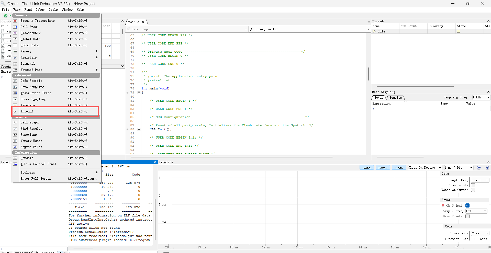
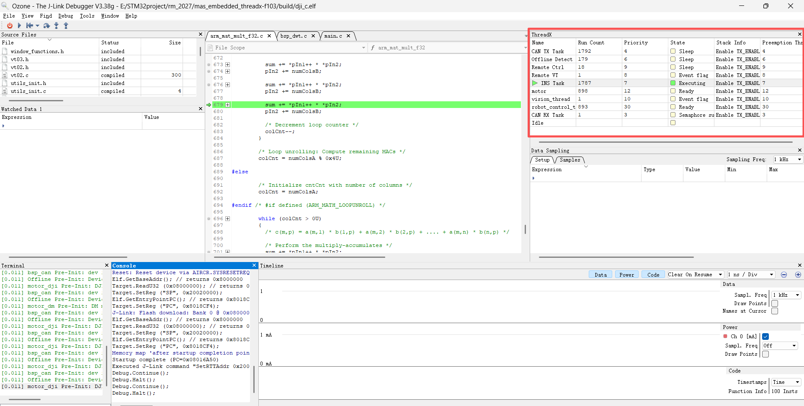

# Ozone 调试器使用笔记

> 基于 SEGGER Ozone V3.38g / V3.40f，配合 J-Link 调试器使用。
> 适用于 mas_embedded_threadx 项目的各板级目标。

---

## 目录

1. [SVD 文件配置](#1-svd-文件配置)
2. [ThreadX OS Plugin 配置](#2-threadx-os-plugin-配置)
3. [View 使用指南](#3-view-使用指南)
4. [常见问题与踩坑](#4-常见问题与踩坑)

---

## 1. SVD 文件配置

SVD（System View Description）文件描述了 MCU 的外设寄存器映射，Ozone 加载后可在调试时直接查看和修改外设寄存器的值。

### 1.1 获取 SVD 文件

对于 STM32 系列芯片，SVD 文件可以从以下来源获取：

- **SEGGER 自带**：安装目录 `Config/Peripherals/` 下已包含部分 STM32 系列（如 `STM32F103xx.svd`、`STM32F407IG.svd` 等）
- **GitHub 社区**：[cmsis-svd-stm32](https://github.com/modm-io/cmsis-svd-stm32) 仓库收录了几乎所有 STM32 系列的 SVD 文件
- **芯片厂商**：STM32CubeMX 生成的 Pack 包中也包含 SVD 文件

### 1.2 放置位置

将下载的 SVD 文件放到 Ozone 安装目录下的外设配置目录：

```
E:\Program Files\SEGGER\Ozone\Config\Peripherals\STM32F105xx.svd
```

> 统一放在 `Config/Peripherals/` 下便于管理，也方便在 `.jdebug` 中使用 `$(InstallDir)` 相对路径引用。

### 1.3 在 New Project Wizard 中配置

新建项目时，在 **Target Device** 页面的 **Peripherals (optional)** 栏选择对应的 SVD 文件：



> 如果已有 `.jdebug` 文件，也可以通过 `Project.AddSvdFile()` 函数指定 SVD 路径。

---

## 2. ThreadX OS Plugin 配置

Ozone 通过 Plugin 机制支持 RTOS 感知调试（RTOS Awareness），加载 ThreadX 插件后可以在调试界面中查看所有线程状态、Run Count、优先级等信息。

### 2.1 插件位置

Ozone 的 OS Plugin 位于安装目录下：

```
E:\Program Files\SEGGER\Ozone\Plugins\OS\
```

该目录下包含多个 RTOS 插件文件，ThreadX 相关的插件文件名为 `ThreadXPlugin.js`（部分版本可能为 `ThreadX.js`）。

### 2.2 通过 Console 命令加载

打开 **View → Console**（快捷键 `Alt+Shift+C`）：



在 Console 面板中输入命令：

```javascript
Project.SetOSPlugin("ThreadX");
```

> 插件的名称可以从 `Plugins/OS/` 目录下查看，去掉 `.js` 后缀即为插件名。**如果文件名是 `ThreadXPlugin.js`，则命令为 `Project.SetOSPlugin("ThreadXPlugin")`。**

执行后 Console 会输出类似以下信息表示加载成功：

```
Project.SetOSPlugin ("ThreadX");
File name resolved: "ThreadX.js" was found
RTOS awareness plugin loaded: E:/Program Files/SEGGER/Ozone/Plugins/OS/ThreadX.js
```

### 2.3 在 View 中勾选 ThreadX 面板

插件加载成功后，在 **View** 菜单中会出现 **ThreadX** 选项（快捷键 `Alt+Shift+O`），勾选即可打开 ThreadX 任务监控面板：



### 2.4 查看线程运行状态

ThreadX 面板会列出所有已创建的任务，关键列说明：

| 列名 | 说明 | 用途 |
|------|------|------|
| **Name** | 任务名称 | 与 `tx_thread_create` 创建时的名称一致 |
| **Run Count** | 运行次数 | 判断任务是否被调度到——长时间不增长的线程可能被卡住 |
| **Priority** | 优先级 | ThreadX 中数值越小优先级越高 |
| **State** | 任务状态 | Executing / Ready / Sleep / Event flag / Semaphore su 等 |
| **Stack Info** | 栈信息 | 栈使用情况，判断是否溢出 |



**实用技巧**：

- **Run Count 检查**：如果某个任务的 Run Count 始终不增长，说明该任务未被调度（可能被阻塞或优先级过低）
- **State 为 Executing** 的任务即当前正在运行的任务，绿色高亮标识
- 结合 `Preemption Threshold` 列可以排查优先级反转问题

### 2.5 配合 ULOG 日志系统

在调试过程中，结合 [[../../02_code_twin/utils/ulog]] 日志系统可以更全面地分析线程行为：

- **Terminal 面板**（`Alt+Shift+T`）实时查看各线程的 `LOG_I` / `LOG_W` / `LOG_E` 输出
- **ThreadX 面板**观察 Run Count 和 State
- 两者配合：日志看到报错 → ThreadX 面板看对应线程当前状态，快速定位问题

---

## 3. View 使用指南

Ozone 提供多个调试视图面板，通过 **View** 菜单打开（或使用快捷键）。

### 3.1 常用面板一览

| 面板                | 快捷键           | 用途                                                 |
| ----------------- | ------------- | -------------------------------------------------- |
| **Disassembly**   | `Alt+Shift+D` | 反汇编窗口，查看当前 PC 对应的汇编指令                              |
| **Registers**     | 无             | 查看和修改内核寄存器（R0-R15、SP、LR、PC、xPSR 等）                 |
| **Memory**        | 无             | 内存查看器，按字节/半字/字查看指定地址的内存数据                          |
| **Call Stack**    | `Alt+Shift+K` | 函数调用栈，定位异常发生时的调用链路                                 |
| **Local Data**    | `Alt+Shift+L` | 当前函数的局部变量                                          |
| **Global Data**   | `Alt+Shift+G` | 全局变量与静态变量                                          |
| **Watched Data**  | 无             | 自定义监视表达式（支持输入变量名或表达式）                              |
| **ThreadX**       | `Alt+Shift+O` | ThreadX 任务监控（需先加载 OS Plugin）                       |
| **Console**       | `Alt+Shift+C` | 控制台，执行脚本命令                                         |
| **Terminal**      | `Alt+Shift+T` | 查看 RTT 日志输出，用法详见 [[../../02_code_twin/utils/ulog]] |
| **Timeline**      | `Alt+Shift+N` | 时序分析，配合 Data Sampling 使用                           |
| **Data Sampling** | `Alt+Shift+Y` | 数据采样，定时采集变量值并绘图                                    |
| **Code Profile**  | `Alt+Shift+P` | 代码性能分析                                             |
| **Source Files**  | `Alt+Shift+U` | 源文件列表                                              |

### 3.2 调试常用流程

**查看线程是否卡住**：
1. 加载 ThreadX Plugin（Console → `Project.SetOSPlugin("ThreadX")`）
2. 打开 ThreadX 面板（View → ThreadX / `Alt+Shift+O`）
3. 观察各任务的 **Run Count** 是否正常增长
4. 检查 **State** 列，确认任务是否处于预期状态

**定位 HardFault**：
1. 打开 **Call Stack**（`Alt+Shift+K`）查看异常前的调用链路
2. 打开 **Registers** 查看（特别是 PC、LR、xPSR 寄存器）
3. 打开 **Disassembly**（`Alt+Shift+D`）定位到异常前最后执行的指令

**监测全局变量**：
1. 在 **Watched Data** 面板右键 → Add Expression
2. 或直接使用 **Global Data**（`Alt+Shift+G`）搜索变量名

---

## 4. 常见问题与踩坑

### 4.1 ThreadX 面板不显示

- 确认已执行 `Project.SetOSPlugin("ThreadX")` 命令（Console 需显示 `RTOS awareness plugin loaded`）
- 确认 `Plugins/OS/` 目录下存在对应的 `.js` 文件
- 检查插件文件名——部分版本叫 `ThreadXPlugin.js`，部分叫 `ThreadX.js`

### 4.2 SVD 未加载

- 检查 SVD 路径是否正确，建议优先使用 `$(InstallDir)` 相对路径
- 确认 SVD 文件对应正确的芯片型号（STM32F105 不能用 STM32F103 的 SVD）
- 在 Ozone 中可通过 **J-Link Control Panel** 确认 SVD 是否已加载

### 4.3 调试连接失败

- 确认 J-Link 驱动已安装，USB 线缆连接正常
- 检查 SWD 接线：SWDIO、SWCLK、GND 三线是否导通
- 尝试降低 SWD 速度：`Project.SetTIFSpeed("1 MHz")`
- 如果使用 V3.40f 及以上版本，注意版本兼容性