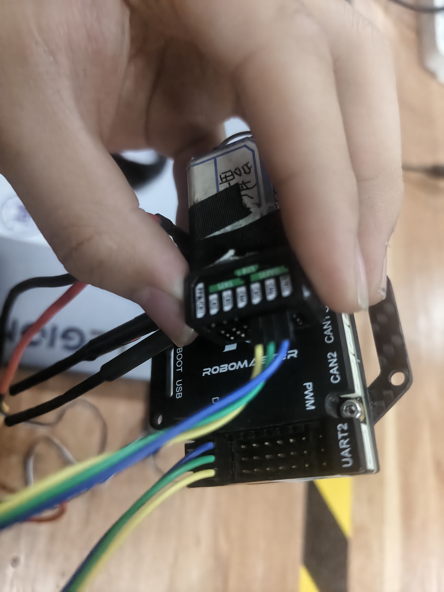
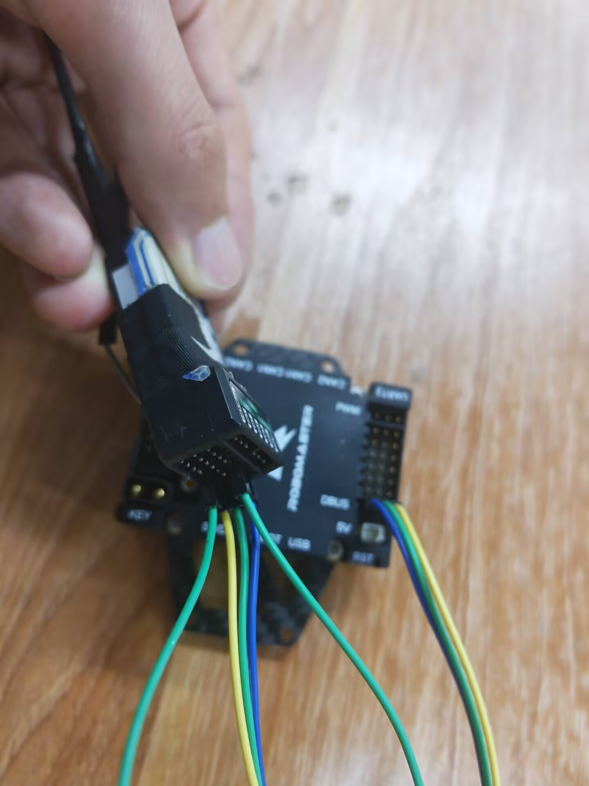

# SBUS 遥控器使用经验

> 本文为实操经验，非协议提炼。协议参数见 [[01_extracted/remote/remote_protocol]]。

---

## 选购要求

- 必须支持**自动归中**（摇杆松手自动回中位）
- 启动**不需要上摇摇杆**（部分遥控器需要上推摇杆才能启动，影响比赛流程）
- 至少 **10 通道**（4 摇杆 + 4 开关 + 2 旋钮/扩展）

## 遥控器与接收机的配对

### 接线

C 板 DBUS 口接三根杜邦线到接收机右侧 3×7 接口中的一排（三个引脚）：

- DBUS 接口**中间**杜邦线 → 接收机**中间一列**
- 靠近 C 板 DBUS 的杜邦线 → 接收机**靠近字的一列**

同时要把接收机**两侧的接口短接**，进入配对模式。

### 配对步骤

1. 接收机两侧短接后，出现**红灯快闪** = 进入配对模式
2. **先按住左下角黑色圆点**，再打开遥控器电源
3. 配对成功后红灯变为慢闪

> 如果没亮红灯，说明两侧的线接反了，交换即可。**如果冒烟了表示接收机烧了**——中间的线没接对。

## 接收机的使用

配对完成后：

- 接收机**靠近字的一列**与 C 板 DBUS 接口相连
- 从上到下取三个接口
- 中间对应 DBUS 中间，上面对应靠近 DBUS 的
- **红灯慢闪** = 接收机配置好了

## 遥控器操作

### 基本操作

1. 打开后需要**上移拨杆**启动
2. ABCD 四个拨杆（从左到右）可以在机械层面换通道数
   - 拨杆 A、B、D 有三个档位，用于控制模式切换
   - 拨杆 C 用于发射命令（自动归中）
3. 中间两个旋钮一般不用
4. 四个齿形按钮（从右到左）对应摇杆的通道 1、2（右摇杆左右/上下）、3、4（左摇杆上下/左右）的**校准按钮**

### 菜单操作

屏幕两边有四个按钮，用于设置遥控器：

| 按钮 | 功能 |
|------|------|
| 右上 (OK) | 长按进入菜单 / 确认 |
| 左上 (UP) | 切换上一个 |
| 左下 (DOWN) | 切换下一个 |
| 右下 (CANCEL) | 取消 |

**查看通道值**：长按 OK → UP 进入功能 → 选"通道显示" → OK

### 工厂设置（调节启动时是否需要上推摇杆）

1. 遥控器**未启动**时，把摇杆向左下拉
2. 再按正常启动方法开机
3. 摇杆标准选中间位置

> 如果不需要上推摇杆启动，通过工厂设置调整。

## CAN 线接线参考

C 板 CAN 接口线序和达妙电机接线方向见 [[01_extracted/motor/motor_params#CAN 接线方向]]。

